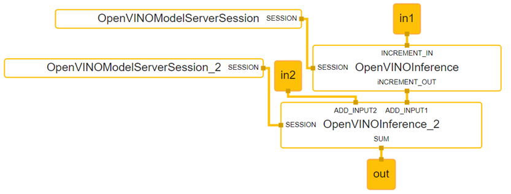

# Mediapipe calculators

This page documents how to use calculators with OpenVINO backend to run Inference operations in the Mediapipe graph. The OpenVINO calculators follow the setup similar to existing TensorFlow calculators. There is an Inference calculator which employs ModelAPI interface. It can be accompanied by the Session calculator including an adapter to a specific backend type.


### OVMSInferenceAdapter

OVMSInferenceAdapter is an implementation of [OpenVINO Model API](https://github.com/openvinotoolkit/model_api) Adapter [interface](https://github.com/openvinotoolkit/model_api/blob/master/model_api/cpp/adapters/include/adapters/inference_adapter.h) that executes inference with OVMS [C-API](https://github.com/openvinotoolkit/model_server/blob/main/docs/model_server_c_api.md).

### OpenVINOModelServerSessionCalculator

[OpenVINOModelServerSessionCalculator](openvinomodelserversessioncalculator.cc) is creating OpenVINO Model Server Adapter to declare which servable should be used in inferences. It has mandatory field `servable_name` and optional `servable_version`. In case of missing `servable_version` calculator will use default version for targeted servable. Another optional field is `server_config` which is a file path to OpenVINO Model Server configuration file. This field is needed only in standalone MediaPipe applications when server was not initialized earlier via [C-API](https://github.com/openvinotoolkit/model_server/blob/main/docs/model_server_c_api.md). In this case, the calculator triggers server start through [C-API](https://github.com/openvinotoolkit/model_server/blob/main/docs/model_server_c_api.md)

### OpenVINOInferenceCalculator

[OpenVINOInferenceCalculator](openvinoinferencecalculator.cc) is using `OVMSInferenceAdapter` received as `input_side_packet` to execute inference with [OpenVINO Model Server C-API](https://github.com/openvinotoolkit/model_server/blob/main/docs/model_server_c_api.md). It can use `options` field `tag_to_input_tensor_names` and `tag_to_output_tensor_names` to map MediaPipe stream names and servable (Model/DAG) inputs and/or outputs. Options `input_order_list` and `output_order_list` can be used together with packet types using `std::vector<T>` to transform input/output maps to desired order in vector of tensors. This guarantees correct order of inputs and outputs in the pipeline. 

Accepted packet types and tags are listed below:

|pbtxt line|input/output|tag|packet type|stream name|
|:---|:---|:---|:---|:---|
|input_stream: "a"|input|none|ov::Tensor|a|
|output_stream: "OVTENSOR:b"|output|OVTENSOR|ov::Tensor|b|
|output_stream: "OVTENSORS:b"|output|OVTENSORS|std::vector\<ov::Tensor\>|b|
|output_stream: "TENSOR:b"|output|TENSOR|mediapipe::Tensor|b|
|input_stream: "TENSORS:b"|input|TENSORS|std::vector\<mediapipe::Tensor\>|b|

In case of missing tag calculator assumes that the packet type is `ov::Tensor'.

## Example of the graph with OpenVINO calculators:

The example below includes two models in the pipeline.
Each model is associated with one OpenVINOInferenceCalculator calculator which takes one side packet which is the Session from OpenVINOModelServerSessionCalculator.


```
input_stream: "in1"
input_stream: "in2"
output_stream: "out"
node {
  calculator: "OpenVINOModelServerSessionCalculator"
  output_side_packet: "SESSION:increment"

  node_options: {
    [type.googleapis.com/mediapipe.OpenVINOModelServerSessionCalculatorOptions]: {
      servable_name: "increment"
      servable_version: "1"
      server_config: "/config/config.json"
    }
  }
}
node {
  calculator: "OpenVINOModelServerSessionCalculator"
  output_side_packet: "SESSION:add"
  node_options: {
    [type.googleapis.com/mediapipe.OpenVINOModelServerSessionCalculatorOptions]: {
      servable_name: "add"
      servable_version: "1"
      server_config: "/config/config.json"
    }
  }
}
node {
  calculator: "OpenVINOInferenceCalculator"
  input_side_packet: "SESSION:increment"
  input_stream: "INCREMENT_IN:in1"
  output_stream: "iNCREMENT_OUT:increment_output"
  node_options: {
    [type.googleapis.com/mediapipe.OpenVINOInferenceCalculatorOptions]: {
        tag_to_input_tensor_names {
          key: "INCREMENT_IN"
          value: "b"
        }
        tag_to_output_tensor_names {
          key: "INCREMENT_OUT"
          value: "a"
        }
    }
  }
}
node {
  calculator: "OpenVINOInferenceCalculator"
  input_side_packet: "SESSION:add"
  input_stream: "ADD_INPUT1:increment_output"
  input_stream: "ADD_INPUT2:in2"
  output_stream: "SUM:out"
  node_options: {
    [type.googleapis.com/mediapipe.OpenVINOInferenceCalculatorOptions]: {
        tag_to_input_tensor_names {
          key: "ADD_INPUT1"
          value: "input1"
        }
        tag_to_input_tensor_names {
          key: "ADD_INPUT2"
          value: "input2"
        }
        tag_to_output_tensor_names {
          key: "SUM"
          value: "sum"
        }
    }
  }
}
```


## How to adjust existing graphs to perform inference with OpenVINO Model Server
Please check following [link](https://github.com/openvinotoolkit/model_server/blob/main/docs/mediapipe_conversion.md#how-to-adjust-existing-graphs-to-perform-inference-with-openvino-model-server) and look up required steps to adjust existing graphs.
