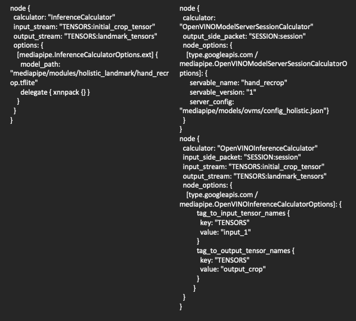
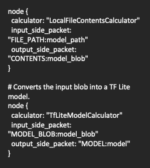
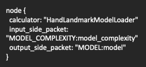
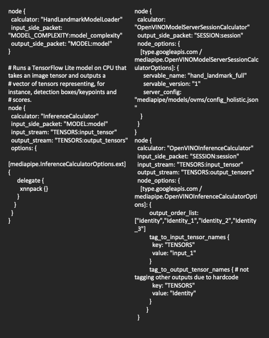

# Mediapipe calculators

This page documents how to use calculators with OpenVINO backend to run Inference operations in the Mediapipe graph. The OpenVINO calculators follow the setup similar to existing TensorFlow calculators. There is an Inference calculator which employs ModelAPI interface. It can be accompanied by the Session calculator including an adapter to a specific backend type.


### OVMSInferenceAdapter

OVMSInferenceAdapter is an implementation of [OpenVINO Model API](https://github.com/openvinotoolkit/model_api) Adapter [interface](https://github.com/openvinotoolkit/model_api/blob/master/model_api/cpp/adapters/include/adapters/inference_adapter.h) that executes inference with OVMS [C-API](https://github.com/openvinotoolkit/model_server/blob/main/docs/model_server_c_api.md).

### OpenVINOModelServerSessionCalculator

[OpenVINOModelServerSessionCalculator](openvinomodelserversessioncalculator.cc) is creating OpenVINO Model Server Adapter to declare which servable should be used in inferences. It has mandatory field `servable_name` and optional `servable_version`. In case of missing `servable_version` calculator will use default version for targeted servable. Another optional field is `server_config` which is a file path to OpenVINO Model Server configuration file. This field is needed only in standalone MediaPipe applications when server was not initialized earlier via [C-API](https://github.com/openvinotoolkit/model_server/blob/main/docs/model_server_c_api.md). In this case, the calculator triggers server start through [C-API](https://github.com/openvinotoolkit/model_server/blob/main/docs/model_server_c_api.md)

### OpenVINOInferenceCalculator

[OpenVINOInferenceCalculator](openvinoinferencecalculator.cc) is using `OVMSInferenceAdapter` received as `input_side_packet` to execute inference with [OpenVINO Model Server C-API](https://github.com/openvinotoolkit/model_server/blob/main/docs/model_server_c_api.md). It can use `options` field `tag_to_input_tensor_names` and `tag_to_output_tensor_names` to map MediaPipe stream names and servable (Model/DAG) inputs and/or outputs. Options `input_order_list` and `output_order_list` can be used together with packet types using `std::vector<T>` to transform input/output maps to desired order in vector of tensors. This guarantees correct order of inputs and outputs in the pipeline. Example of usage can be found [here](../../modules/pose_landmark/pose_landmark_by_roi_cpu.pbtxt).

Accepted packet types and tags are listed below:

|pbtxt line|input/output|tag|packet type|stream name|
|:---|:---|:---|:---|:---|
|input_stream: "a"|input|none|ov::Tensor|a|
|output_stream: "OVTENSOR:b"|output|OVTENSOR|ov::Tensor|b|
|output_stream: "OVTENSORS:b"|output|OVTENSORS|std::vector<ov::Tensor>|b|
|output_stream: "TENSOR:b"|output|TENSOR|mediapipe::Tensor|b|
|input_stream: "TENSORS:b"|input|TENSORS|std::vector<mediapipe::Tensor>|b|

In case of missing tag calculator assumes that the packet type is `ov::Tensor'.

## How to prepare OpenVINO Model Server deployment with Mediapipe
We have to prepare OVMS configuration files and models repository. There are two ways that would have different benefits. First one would be better if you want to have just one model server service containing all servables. This may be especially useful if you will reuse models between several pipelines in the same deployment. In this case servables directory structure would look like:
```
servables/
├── config.json
├── add_two_inputs_model
│   └── 1
│       ├── add.bin
│       └── add.xml
├── dummy
│   └── 1
│       ├── dummy.bin
│       └── dummy.xml
└── dummyAdd
    └── graph.pbtxt
```
And the config.json:
```
{
  "model_config_list": [
    {
      "config": {
        "name": "dummy",
        "base_path": "dummy"
      }
    },
    {
      "config": {
        "name": "add",
        "base_path": "add_two_inputs_model"
      }
    }
  ]
  "mediapipe_config_list": [
    {
      "name":"dummyAdd"
    }
  ]
}
```
Second one would be better if you would have several services each containig separate mediapipe. Using this way it can be easier to perform updates to the deployments, and keep mediapipes self contained. In this case you would prepare directories as shown below
```
servables/
├── config.json
└── dummyAdd
    ├── add_two_inputs_model
    │   └── 1
    │       ├── add.bin
    │       └── add.xml
    ├── dummy
    │   └── 1
    │       ├── dummy.bin
    │       └── dummy.xml
    ├── graph.pbtxt
    └── subconfig.json
```
and config.json:
```
{
  "model_config_list": [],
  "mediapipe_config_list": [
    {
      "name":"dummyAdd"
    }
  ]
}
```
and the subconfig.json:
```
{
  "model_config_list": [
    {
      "config": {
        "name": "dummy",
        "base_path": "dummy"
      }
    },
    {
      "config": {
        "name": "add",
        "base_path": "add_two_inputs_model"
      }
    }
  ]
}
```
Where `servables` directory will be mounted to OVMS container. You can find more details about OVMS configuration in [documentation](https://docs.openvino.ai/2023.1/ovms_docs_serving_model.html#serving-multiple-models).
To make already prepared graphs use OpenVINO Model Server for inferences there are following steps involved:

*Note* base paths in config.json are relative to the file path of config.json.
## How to adjust existing graphs to perform inference with OpenVINO Model Server

1. Adjust original graph.pbtxt file. You need to replace InferenceCalculator node with OpenVINOInferenceCalculator and need to add OpenVINOModelServerSessionCalculator nodes. Set OpenVINOModelServerSessionCalculator `servable_name` and `servable_version` if necessary. On the left is part of old pbtxt file that was converted to use OVMS for inference.



If there were LocalFileContentsCalculators or ModelLoaderCalculators that passed model blob directly to InferenceCalculator as side input packet you can remove those from graph. Examples:




2. Check packet types that were passed into InferenceCalculator as input or outputs streams. In MediaPipe repository those are commonly either `std::vector<TfLiteTensor>` or `std::vector<mediapipe::Tensor>`.
Then declare input and output tags for OpenVINOInferenceCalculator.
3. Map node inputs and outputs to model using `tag_to_input_tensor_names` and `tag_to_output_tensor_names` options. In case model has more than one input/output and you need to pass vector of tensors into calculator you may need to use `input_order_list` and `output_order_list` to declare order of tensors.
Example of conversion where there are multiple outputs:




