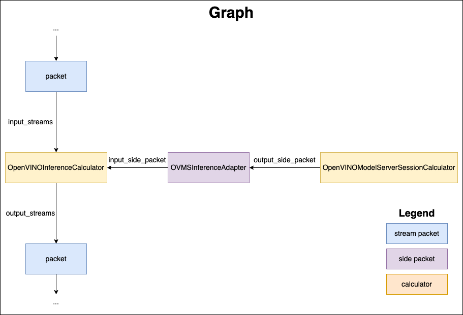

# Mediapipe calculators

This page documents how to use calculators with OpenVINO backend to run Inference operations in the Mediapipe graph. The OpenVINO calculators follow the setup similar to existing TensorFlow calculators. There is an Inference calculator which employs ModelAPI interface. It can be accompanied by the Session calculator including an adapter to a specific backend type.



### OVMSInferenceAdapter

OVMSInferenceAdapter is an implementation of [OpenVINO Model API](https://github.com/openvinotoolkit/model_api) Adapter [interface](https://github.com/openvinotoolkit/model_api/blob/master/model_api/cpp/adapters/include/adapters/inference_adapter.h) that executes inference with OVMS [C-API](https://github.com/openvinotoolkit/model_server/blob/main/docs/model_server_c_api.md).

### OpenVINOModelServerSessionCalculator

[OpenVINOModelServerSessionCalculator](openvinomodelserversessioncalculator.cc) is creating OpenVINO Model Server Adapter to declare which servable should be used in inferences. It has mandatory field `servable_name` and optional `servable_version`. In case of missing `servable_version` calculator will use default version for targeted servable. Another optional field is `server_config` which is a file path to OpenVINO Model Server configuration file. This field is needed only in standalone MediaPipe applications when server was not initialized earlier via [C-API](https://github.com/openvinotoolkit/model_server/blob/main/docs/model_server_c_api.md). In this case, the calculator triggers server start through [C-API](https://github.com/openvinotoolkit/model_server/blob/main/docs/model_server_c_api.md)

### OpenVINOInferenceCalculator

[OpenVINOInferenceCalculator](openvinoinferencecalculator.cc) is using `OVMSInferenceAdapter` received as `input_side_packet` to execute inference with [OpenVINO Model Server C-API](https://github.com/openvinotoolkit/model_server/blob/main/docs/model_server_c_api.md). It can use `options` field `tag_to_input_tensor_names` and `tag_to_output_tensor_names` to map MediaPipe stream names and servable (Model/DAG) inputs and/or outputs. Options `input_order_list` and `output_order_list` can be used together with packet types using `std::vector<T>` to transform input/output maps to desired order in vector of tensors. This guarantees correct order of inputs and outputs in the pipeline. Example of usage can be found [here](../../modules/pose_landmark/pose_landmark_by_roi_cpu.pbtxt).

Accepted packet types and tags are listed below:

|pbtxt line|input/output|tag|packet type|stream name|
|:---|:---|:---|:---|:---|
|input_stream: "a"|input|none|ov::Tensor|a|
|output_stream: "OVTENSOR:b"|output|OVTENSOR|ov::Tensor|b|
|output_stream: "OVTENSORS:b"|output|OVTENSORS|std::vector<ov::Tensor>|b|
|output_stream: "TENSOR:b"|output|TENSOR|mediapipe::Tensor|b|
|input_stream: "TENSORS:b"|input|TENSORS|std::vector<mediapipe::Tensor>|b|

In case of missing tag calculator assumes that the packet type is `ov::Tensor'.

## How to reuse existing graph from MediaPipe in OpenVINO Model Server
## How to get models used in MediaPipe demos
To get the model used in MediaPipe demo you can either trigger build target that depends upon that model and then search in bazel cache or download directly from locations below
* https://storage.googleapis.com/mediapipe-models/
* https://storage.googleapis.com/mediapipe-assets/

## How to prepare OpenVINO Model Server deployment with Mediapipe
We have to prepare OVMS configuration files and models repository. There are two ways that would have different benefits. First one would be better if you want to have just one model server service containing all servables. This may be especially useful if you will reuse models between several pipelines in the same deployment. In this case servables directory structure would look like:
```
servables/
├── config.json
├── add_two_inputs_model
│   └── 1
│       ├── add.bin
│       └── add.xml
├── dummy
│   └── 1
│       ├── dummy.bin
│       └── dummy.xml
└── dummyAdd
    └── graph.pbtxt
```
And the config.json:
```
{
  "model_config_list": [
    {
      "config": {
        "name": "dummy",
        "base_path": "dummy"
      }
    },
    {
      "config": {
        "name": "add",
        "base_path": "add_two_inputs_model"
      }
    }
  ]
  "mediapipe_config_list": [
    {
      "name":"dummyAdd"
    }
  ]
}
```
Second one would be better if you would have several services each containig separate mediapipe. Using this way it can be easier to perform updates to the deployments, and keep mediapipes self contained. In this case you would prepare directories as shown below
```
servables/
├── config.json
└── dummyAdd
    ├── add_two_inputs_model
    │   └── 1
    │       ├── add.bin
    │       └── add.xml
    ├── dummy
    │   └── 1
    │       ├── dummy.bin
    │       └── dummy.xml
    ├── graph.pbtxt
    └── subconfig.json
```
and config.json:
```
{
  "model_config_list": [],
  "mediapipe_config_list": [
    {
      "name":"dummyAdd"
    }
  ]
}
```
and the subconfig.json:
```
{
  "model_config_list": [
    {
      "config": {
        "name": "dummy",
        "base_path": "dummy"
      }
    },
    {
      "config": {
        "name": "add",
        "base_path": "add_two_inputs_model"
      }
    }
  ]
}
```
Where `servables` directory will be mounted to OVMS container. You can find more details about OVMS configuration in [documentation](https://docs.openvino.ai/2023.1/ovms_docs_serving_model.html#serving-multiple-models).
To make already prepared graphs use OpenVINO Model Server for inferences there are following steps involved:

*Note* base paths in config.json are relative to the file path of config.json.
## How to adjust existing graphs to perform inference with OpenVINO Model Server
Now we will show steps that are required or may be optional to convert existing graph to use OV for inference.
1) First step is *optional*.
Let's assume we start with graph like [this](https://github.com/google/mediapipe/blob/v0.10.3/mediapipe/graphs/holistic_tracking/holistic_tracking_cpu.pbtxt).
We can't find direct usage of inference calculators in this graph and that is because it is using `subgraph` concept from MediaPipe framework. It allows you to register existing graph as a single calculator. We have to search for such nodes in graph and find out each subgraph that is directly using inference calculators. We can grep the MediaPipe code for:
```
grep -R -n "register_as = \"HolisticLandmarkCpu"
```
We will find that in using bazel `mediapipe_simple_subgraph` function another `pbtxt` file was registered as a graph. Since in that file there is no inference calculator we need to repeat the procedure until we find all inference calculators used directly or indirectly using subgraphs.
2) We need to start with basic replacement of inference calculator. Existing configuration could look like:
```
node {
  calculator: "HandLandmarkModelLoader"
  input_side_packet: "MODEL_COMPLEXITY:model_complexity"
  output_side_packet: "MODEL:model"
}
node {
  calculator: "InferenceCalculator"
  input_side_packet: "MODEL:model"
  input_stream: "TENSORS:input_tensor"
  output_stream: "TENSORS:output_tensors"
  options: {
    [mediapipe.InferenceCalculatorOptions.ext] {
      model_path: "mediapipe/modules/holistic_landmark/hand_recrop.tflite"
      delegate {
        xnnpack {}
      }
    }
  }
}
```
This tells us which model is used (hand_recrop) and what type of packets are send to inference calculator (vector<mediapipe::Tensor>). We also need information what are model names inputs. This could be checked f.e. using OMVS logs or metadata request calls. With that information we would replace that part of a graph with:
```
node {
  calculator: "OpenVINOModelServerSessionCalculator"
  output_side_packet: "SESSION:session"
  node_options: {
    [type.googleapis.com / mediapipe.OpenVINOModelServerSessionCalculatorOptions]: {
      servable_name: "hand_recrop"
      servable_version: "1"
    }
  }
}
node {
  calculator: "OpenVINOInferenceCalculator"
  input_side_packet: "SESSION:session"
  input_stream: "TENSORS:initial_crop_tensor"
  output_stream: "TENSORS:landmark_tensors"
  node_options: {
    [type.googleapis.com / mediapipe.OpenVINOInferenceCalculatorOptions]: {
          tag_to_input_tensor_names {
            key: "TENSORS"
            value: "input_1"
          }
          tag_to_output_tensor_names {
            key: "TENSORS"
            value: "output_crop"
          }
        }
  }
}
```
In OpenVINOModelServerSessionCalculator we set servable_name with the model name we found earlier. In OpenVINOInferenceCalculator we set input & output tags names to start with TENSORS. We then need to map out those tags to actual model names in `mediapipe.OpenVINOInferenceCalculatorOptions` `tag_to_input_tensor_names` and `tag_to_output_tensor_names` fields.

3) Third step is optional and may be required if model has multiple inputs/outputs and is using vector of some types as input/output packet types. Lets assume model produces several outputs - we have to figure out the correct ordering of tensors - expected by the graph. When we do that we need to add following section to `OpenVINOInferenceCalculatorOptions`:
```
output_order_list: ["Identity","Identity_1","Identity_2","Identity_3"]
```
In case of multiple inputs we have to do similar steps.


