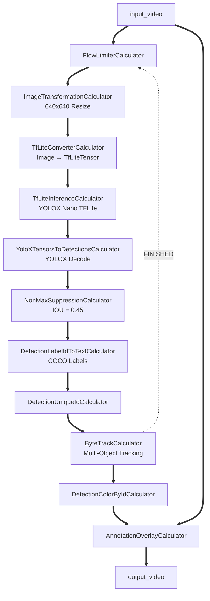
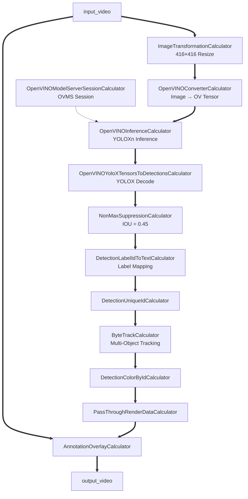

# ByteTrack Demo

This project demonstrates real-time multi-object tracking using YOLOX-Nano and ByteTrack using MediaPipe pipelines.

The demos explore different inference backends and graph architectures.

## Available Demos

> **Note:** `PassThroughRenderDataCalculator` is used during the initial development stage for debugging graph outputs.

---

# 1. `bytetrack_final_cpu`

This demo performs ByteTrack inference using a TensorFlow Lite YOLOX model.

## Build

```bash
bazel build -c opt --define MEDIAPIPE_DISABLE_GPU=1 \
mediapipe/examples/desktop/bytetrack:bytetrack_final_cpu
```

## Run

```bash
bazel-bin/mediapipe/examples/desktop/bytetrack/bytetrack_final_cpu \
--calculator_graph_config_file=mediapipe/graphs/bytetrack/bytetrack_cpu.pbtxt \
--input_video_path=/mediapipe/mediapipe/examples/desktop/object_detection/test_video.mp4 \
--output_video_path=/mediapipe/out_bt_cpu.mp4
```

## Graph Flow



---

# 2. `bytetrack_final_ovms`

This demo performs ByteTrack inference using OpenVINO Model Server (OVMS).

## Build

```bash
bazel build -c opt --define MEDIAPIPE_DISABLE_GPU=1 \
mediapipe/examples/desktop/bytetrack:bytetrack_final_ovms
```

## Run

```bash
bazel-bin/mediapipe/examples/desktop/bytetrack/bytetrack_final_ovms \
--calculator_graph_config_file=mediapipe/graphs/bytetrack/bytetrack_ovms.pbtxt \
--input_video_path=/mediapipe/mediapipe/examples/desktop/object_detection/test_video.mp4 \
--output_video_path=/mediapipe/out_bt_ovms.mp4
```

## Graph Flow



---

# Custom Calculators and Utilities

## Tracking Utilities

### [`matching_utils.h`](../../../graphs/bytetrack/calculators/matching_utils.h)

Utility header containing helper functions used for matching and object association during ByteTrack execution.

Implemented methods:

- `ComputeIoU` — Computes IoU score between two detection boxes.
- `BuildIoUCostMatrix` — Builds the IoU cost matrix from detections and tracks.
- `FuseScore` — Computes fused score between cost matrix and detections.
- `LinearAssignment` — Performs linear assignment using the Jonker–Volgenant algorithm *(currently under development)*.

---

## Kalman Filter

### [`kalman_filter.cc`](../../../graphs/bytetrack/calculators/kalman_filter.cc)

Implements the Kalman filter logic used by ByteTrack.

The corresponding class structure is defined in:

* [`kalman_filter.h`](../../../graphs/bytetrack/calculators/kalman_filter.h)

Methods:

- `Initiate` — Initializes the Kalman filter state for a new track.
- `Predict` — Predicts the next object state using the previous state.
- `Update` — Corrects the predicted state using the latest detection.
- `MultiPredict` — Performs batch prediction for multiple active tracks.


## Base Tracking Object

### [`basetrack.cc`](../../../graphs/bytetrack/calculators/basetrack.cc)

Defines the base tracking abstraction used in ByteTrack.

Class structure:

- [`basetrack.h`](../../../graphs/bytetrack/calculators/basetrack.h)


## STrack Object

### [`strack.cc`](../../../graphs/bytetrack/calculators/strack.cc)

Defines the `STrack` object used by ByteTrack for managing individual tracked objects.

Class structure:

- [`strack.h`](../../../graphs/bytetrack/calculators/strack.h)

Methods:

- `Predict` — Predicts the next object position.
- `Activate` — Activates a new track from an unmatched detection.
- `ReActivate` — Re-activates a previously lost track.
- `Update` — Updates the track state using the latest matched detection.


## Main ByteTrack Calculator

### [`bytetrack_calculator.cc`](../../../graphs/bytetrack/calculators/bytetrack_calculator.cc)

Main calculator implementing the ByteTrack algorithm.


## YOLOX Tensor Decoders

### [`yolox_tensors_to_detections_calculator.cc`](../../../calculators/tflite/yolox_tensors_to_detections_calculator.cc)

Converts YOLOX TensorFlow Lite output tensors into MediaPipe `Detection` objects.

### [`openvino_yolox_tensors_to_detections_calculator.cc`](../../../calculators/openvino/openvino_yolox_tensors_to_detections_calculator.cc)

Converts YOLOX OpenVINO output tensors into MediaPipe `Detection` objects.


## Detection Visualization

### [`detection_color_by_id_calculator.cc`](../../../calculators/util/detection_color_by_id_calculator.cc)

Assigns a unique visualization color to detections based on tracking ID.

- Hue is derived from the detection ID.
- saturation and value can be configured using calculator options i.e.
    ```
    node {
        calculator: "DetectionColorByIdCalculator"
        input_stream: "DETECTIONS:tracked_detections"
        output_stream: "RENDER_DATA:detections_render_data"
        options: {
            [mediapipe.DetectionColorByIdCalculatorOptions.ext] {
                saturation: 0.85
                value: 0.95
            }
        }
    }

    ```
